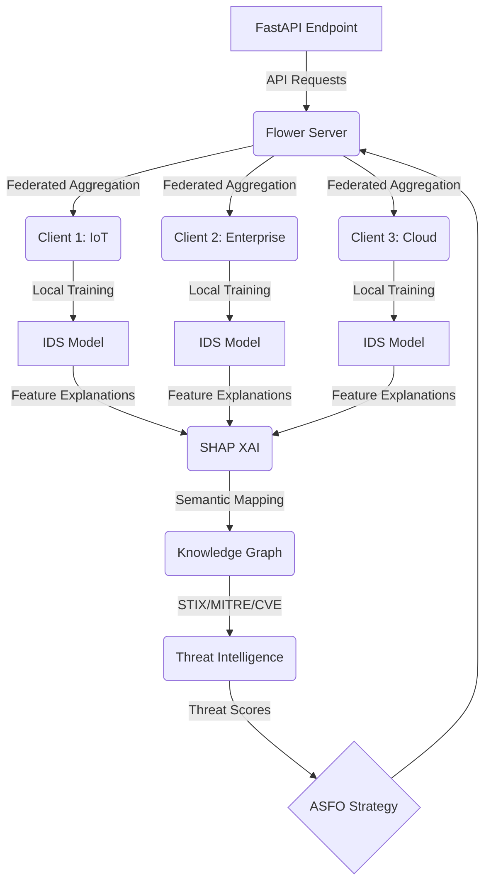

# ASFO: Adaptive Semantic Federated Optimization

**ASFO (Adaptive Semantic Federated Optimization for Cross-Domain Intrusion Detection using Knowledge Graph-Guided Threat Intelligence)** is a production-grade AI research framework for robust and interpretable cross-domain federated learning in cybersecurity.

## 🚀 Overview
ASFO integrates **Federated Learning (FL)**, **Knowledge Graphs (KG)**, and **Explainable AI (XAI)** to build an advanced, semantic-aware optimization algorithm designed to address extreme statistical heterogeneity (Non-IID data) in cross-domain environments (IoT, Enterprise, Cloud).

## 🏛 System Architecture



## 📂 Repository Structure
```
ASFO/
├── app/                  # Application code (API, Core, FL, KG, XAI)
├── datasets/             # Local datasets and preprocessing cache
├── docs/                 # MkDocs documentation & ADRs
├── paper/                # IEEE Paper drafts and assets
├── docker/               # Dockerfiles for services
└── tests/                # Pytest suites
```

## 🛠 Features
- **Federated Optimization:** Implementations of FedAvg, FedProx, FedNova, FedDyn, and the novel **ASFO** algorithm.
- **Threat Intelligence:** Uses Knowledge Graphs constructed from MITRE ATT&CK, STIX, and CVE.
- **Explainable AI (XAI):** Built-in SHAP-based interpretations mapped to semantic concepts.
- **Modern Tech Stack:** FastAPI, Flower, PostgreSQL, Redis, MLflow, Ollama, Docker Compose, uv.

## 📦 Installation & Docker
This project is built using Docker and `uv` for dependency management. Data is persisted securely using Docker Named Volumes.

```bash
# Clone the repository
git clone https://github.com/your-username/asfo.git
cd asfo

# Set up environment variables
cp .env.example .env

# Start the full stack
docker compose --profile full up -d
```

## 🧪 Development Guide
```bash
# Install dependencies
uv sync --dev

# Run tests
uv run pytest

# Build Documentation
uv run mkdocs serve
```

## 🛣 Roadmap
- [x] **Milestone 1:** Repository + Docker + CI/CD
- [ ] **Milestone 2:** Dataset Pipeline
- [ ] **Milestone 3:** Baseline IDS
- [ ] **Milestone 4:** Federated Learning
- [ ] **Milestone 5:** ASFO Algorithm
- [ ] **Milestone 6:** Knowledge Graph
- [ ] **Milestone 7:** XAI
- [ ] **Milestone 8:** Experiments
- [ ] **Milestone 9:** IEEE Paper

## 📚 Citation
*(Citation placeholder - Update after publication)*

## 📄 License
This project is licensed under the Apache 2.0 License. See [LICENSE](LICENSE) for details.
